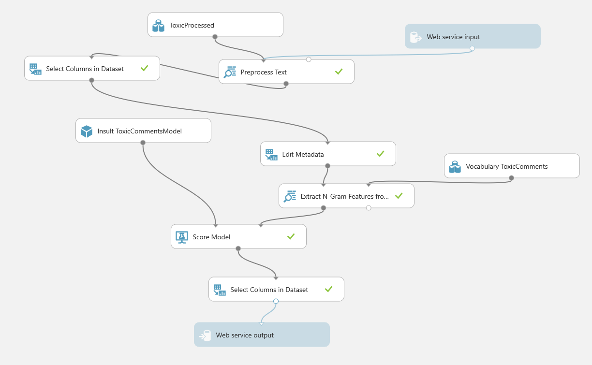
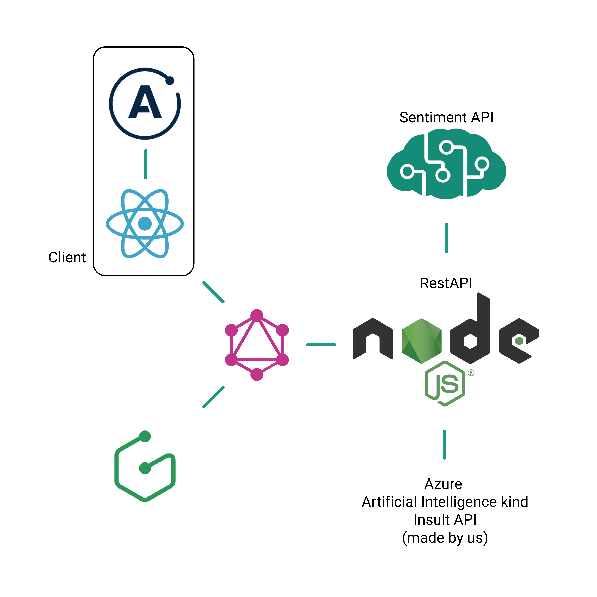

# Kind

This project was made at [Pixels Camp](https://pixels.camp/) in under 48 hours, we took on a challenge proposed by the [Gulbenkian foundation, Hack For Good](https://gulbenkian.pt/hackforgood/).

## The Challenge

> A growing body of evidence indicates that children are accessing the internet at increasingly younger ages. Smartphones are fuelling a ‘bedroom culture’, with online access for many children becoming more personal, more private and less supervised. At the same time, digital technologies are bringing opportunities for learning and education to children, especially in remote regions and during humanitarian crises.

**Technological solutions to prevent and intervene in cyberbullying incidents.**

Which turned into a chat bot, that should be seen as a kind buddy to prevent cyberbullying and social harassment in network acting in between the bully and his victim.

## The Algorithm

We designed a custom Machine Learning webservice, using Azure Cognitive Services, processing the text messages as n-grams and trained a model for the probability of being a message with a "bully" feeling to it. We published this as a web service for consumption from our backend.

This custom service took an input from the Microsoft Text Analytics API aswell to optimize the output.



## The Product

This was intendend to be used for chat rooms where the main audience are children, that's how the product was designed.

**Kind**


Read all about our [product here](./docs/product.md).

## Built With

Given the 48 hour time constraint we tried to use the technologies we knew better as a team and that provided out of the box solutions.

- Real time chat - [Graphcool](https://github.com/prisma/graphcool-framework)
- Client - [React](https://github.com/facebook/react/)
- Kind API - NodeJS with [Express](https://github.com/expressjs/express)
- Sentimental Analysis API - [Microsoft Azure Cognitive Services](https://azure.microsoft.com/en-us/services/cognitive-services/text-analytics/)
- Insult Analysis API - [Microsoft Machine Learning Studio](https://studio.azureml.net/)



## Documentation

We only have one endpoint and that's it.

## **Kindnesss of message**

Returns an analysis of the message, the sentiment, kindness and determines if its kind or not, when not kind we suppose it as an insult.

- **URL**

  /is

- **Method:**

  `POST`

- **Data Params**

  **Required:**

  `message=[string]`

- **Success Response:**

  - **Code:** 200 <br />
    **Content:**

    Message: `Hey`

    ```json
    {
      "success": "true",
      "data": {
        "isKind": true,
        "kindness": 1,
        "sentiment": 0.9869865775108337,
        "insult": "0",
        "message": "kind"
      }
    }
    ```

    Message: `You are dumb`

    ```json
    {
      "success": "true",
      "data": {
        "isKind": false,
        "kindness": 0,
        "sentiment": 0.011714428663253784,
        "insult": "1",
        "message": "insult"
      }
    }
    ```

### Commands

Run in the development environment

```
npm run dev
```

Clean up the code

```
npm run eslint
```

### Deployment

This project was setup to deploy with the Global Serverless Deployments of Now.

Make sure your `src/config.js` file is setup with your API keys, find an example at `src/config.example.js`

Build the project with

`npm run build`

Start the production server

`npm run start`

Deploy, install [Now CLI](https://github.com/zeit/now-cli)
`now`

## Authors

- [António Santos](https://antoniosantos.me)
- [Bruno Gameiro](https://github.com/brunogameiro)
- [Carlos Santos](https://github.com/csantosnapraia)
- [Francisco Regalado](https://github.com/fsfregalado)
- [Henrique Silva](https://github.com/henriquesilva2)
- [Sónia Machado](https://github.com/soniaamachado)
- [Pedro Leite](https://github.com/pleite)
- [Vasco Silva](https://github.com/vascosilvaa)
